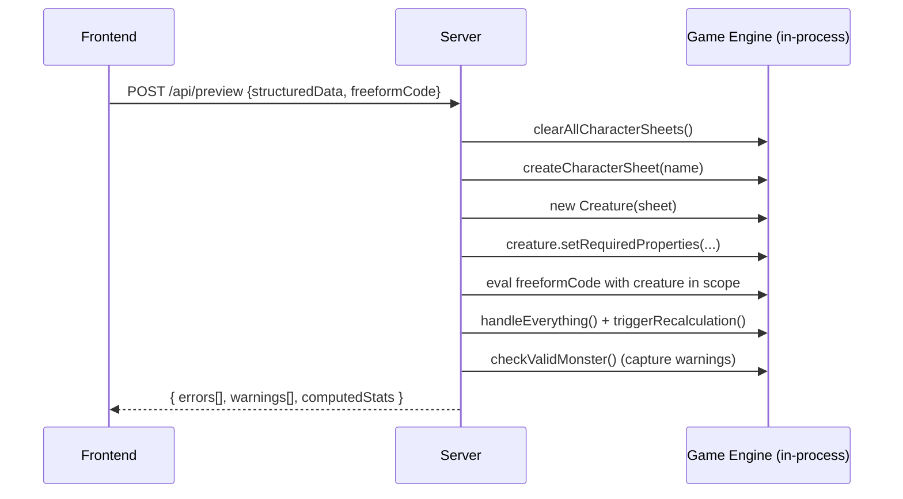

# Rise Monster Creation UI — Project Plan

A local web application at [monster_ui](file:///c:/kevin/github/Rise/typescript/monster_ui) for creating and editing Rise monsters with real-time preview and validation.

---

## Phase Roadmap

The UI will be built incrementally. Each phase moves more monster configuration from freeform code into structured UI fields, with the goal of eliminating freeform code entirely.

| Phase | Scope | Structured Fields |
|---|---|---|
| **1 — Minimal** | Initial implementation target | Monster name, required properties (`alignment`, `base_class`, `elite`, `creature_origin`, `creature_type`, `size`, `level`). Everything else is freeform code. |
| **2 — Simple** | Data-value fields | Phase 1 + `setBaseAttributes`, `setTrainedSkills`, `setKnowledgeResults`, `addTrait`, `addCustomSense`, `addCustomMovementSpeed`, `addImmunity`, `addResistant`, `addVulnerability`, `setEquippedArmorName`, `setProperties({has_art})` |
| **3 — Complex** | Ability builders | Phase 2 + `addSpell`, `addManeuver`, `addCustomSpell`, `addCustomManeuver`, `addPassiveAbility`, `addWeaponMult`, `addGrapplingStrike`, `addSneakAttack`, `addRituals` |
| **4 — Complete** | Remove freeform entirely | All monster configuration is structured. Freeform textarea is removed. |

> [!IMPORTANT]
> This plan implements **Phase 1 only**. Phases 2–4 are documented for design context but will be planned separately.

---

## Project Structure

The monster UI is a **separate package** at `Rise/typescript/monster_ui/`, with its own dependencies and build config, to avoid conflicts with the existing TypeScript project's CommonJS/no-JSX configuration.

```
Rise/typescript/monster_ui/
├── package.json                # React, Vite, Less, Express, concurrently
├── tsconfig.json               # Frontend: JSX, ESM, for Vite/React
├── tsconfig.server.json        # Server: extends ../tsconfig.json for @src/* access
├── vite.config.ts              # Vite config with API proxy to dev server
├── index.html                  # Vite entry point
├── monsters_from_ui.json       # Source-of-truth data file
│
├── src/                        # Frontend (React + Less)
│   ├── main.tsx
│   ├── App.tsx
│   ├── App.less
│   ├── types/
│   │   └── monster.ts          # JSON schema TypeScript types
│   └── components/
│       ├── MonsterSidebar.tsx   # Left sidebar: monster/group list
│       ├── MonsterSidebar.less
│       ├── MonsterForm.tsx      # Left panel: structured fields + freeform textarea
│       ├── MonsterForm.less
│       ├── BookPreview.tsx      # Right panel: computed stats preview
│       ├── BookPreview.less
│       ├── ValidationBox.tsx    # Global validation warnings/errors
│       └── ValidationBox.less
│
└── server/
    ├── index.ts                # Express API server entry point
    ├── validate.ts             # Runs game engine to compute stats + validate
    └── codegen.ts              # Generates monsters_from_ui.ts from JSON
```

Output file (auto-generated, not hand-edited):
```
Rise/typescript/src/monsters/individual_monsters/monsters_from_ui.ts
```

---

## Data Model (JSON Schema)

The source of truth is `monsters_from_ui.json`. Structured fields are stored as typed JSON. Freeform code is stored as a raw string.

```json
{
  "monsters": [
    {
      "name": "Corpsetree",
      "requiredProperties": {
        "alignment": "neutral evil",
        "base_class": "warrior",
        "elite": true,
        "creature_origin": "undead",
        "creature_type": "plant",
        "level": 8,
        "size": "huge"
      },
      "freeformCode": "creature.setKnowledgeResults({\n  normal: `A corpsetree's body is a mixture of rotting flesh and wood.\n    When fresh corpses are left to rot near a dying tree, their lingering soul energy can merge with the tree to create a corpsetree.`,\n});\ncreature.setTrainedSkills(['awareness']);\ncreature.setBaseAttributes([7, -2, 5, -5, 2, 2]);\ncreature.addWeaponMult('fists');\ncreature.addGrapplingStrike('fists');\ncreature.addSpell('Circle of Death', { usageTime: 'elite' });\ncreature.addSpell('Embedded Growth', { usageTime: 'elite' });\ncreature.addSpell('Corpse Explosion', { usageTime: 'elite' });"
    }
  ],
  "monsterGroups": [
    {
      "name": "Ghosts",
      "knowledge": {
        "normal": "Ghosts are the souls of deceased creatures that linger after death instead of proceeding to their proper afterlife.",
        "hard": "Some ghosts can be appeased peacefully if the reason they refused to pass on is addressed. Others can only be banished by force. Although ghosts do not fear cold, they are strongly affected by fire."
      },
      "description": null,
      "hasArt": false,
      "sharedFreeformCode": "creature.addCustomSense('Darkvision (90 ft.)');\ncreature.addCustomMovementSpeed('Fly (average, 30 ft. limit)');",
      "monsters": [
        {
          "name": "Allip",
          "requiredProperties": {
            "alignment": "neutral evil",
            "base_class": "skirmisher",
            "elite": false,
            "creature_origin": "undead",
            "creature_type": "ghost",
            "level": 4,
            "size": "medium"
          },
          "freeformCode": "creature.setProperties({ has_art: true });\ncreature.setKnowledgeResults({\n  normal: `Allips are incorporeal ghost-like creatures.`,\n  hard: `An allip is the spectral remains of someone driven to suicide by madness.`,\n});\ncreature.setTrainedSkills(['awareness', 'stealth']);\ncreature.setBaseAttributes([-9, 3, 0, -2, -2, 6]);\ncreature.addCustomSense('Darkvision (60 ft.)');\ncreature.addCustomSense('Lifesense (120 ft.)');\ncreature.addSpell('Inflict Wound');"
        }
      ]
    }
  ]
}
```

> [!NOTE]
> As phases 2–4 are implemented, fields will move out of `freeformCode` into dedicated structured properties (e.g., `"baseAttributes": [7, -2, 5, -5, 2, 2]`). The codegen and validation helpers will be updated to handle both structured and freeform data.

---

## Concrete Generated File Example

The codegen module produces the following from the JSON above. It is **auto-generated and should not be hand-edited**.

```typescript
// AUTO-GENERATED by monster_ui. Do not edit manually.
// Source: Rise/typescript/monster_ui/monsters_from_ui.json

import { Grimoire } from '@src/monsters/grimoire';
import { Creature, CustomMonsterAbility } from '@src/character_sheet/creature';
import { getWeaponMultByRank } from '@src/abilities/combat_styles';
import { BARRIER_COOLDOWN, BRIEF_COOLDOWN, CONDITION_CRIT } from '@src/abilities/constants';

export function addMonstersFromUi(grimoire: Grimoire) {
  // --- Individual Monsters ---

  grimoire.addMonster('Corpsetree', (creature: Creature) => {
    creature.setRequiredProperties({
      alignment: 'neutral evil',
      base_class: 'warrior',
      elite: true,
      creature_origin: 'undead',
      creature_type: 'plant',
      level: 8,
      size: 'huge',
    });
    // --- Begin freeform code ---
    creature.setKnowledgeResults({
      normal: `A corpsetree's body is a mixture of rotting flesh and wood.
        When fresh corpses are left to rot near a dying tree, their lingering soul energy can merge with the tree to create a corpsetree.`,
    });
    creature.setTrainedSkills(['awareness']);
    creature.setBaseAttributes([7, -2, 5, -5, 2, 2]);
    creature.addWeaponMult('fists');
    creature.addGrapplingStrike('fists');
    creature.addSpell('Circle of Death', { usageTime: 'elite' });
    creature.addSpell('Embedded Growth', { usageTime: 'elite' });
    creature.addSpell('Corpse Explosion', { usageTime: 'elite' });
    // --- End freeform code ---
  });

  // --- Monster Groups ---

  grimoire.addMonsterGroup(
    {
      name: 'Ghosts',
      knowledge: {
        normal: `
          Ghosts are the souls of deceased creatures that linger after death instead of proceeding to their proper afterlife.
        `,
        hard: `
          Some ghosts can be appeased peacefully if the reason they refused to pass on is addressed.
          Others can only be banished by force.
          Although ghosts do not fear cold, they are strongly affected by fire.
        `,
      },
      sharedInitializer: (creature: Creature) => {
        // --- Begin shared freeform code ---
        creature.addCustomSense('Darkvision (90 ft.)');
        creature.addCustomMovementSpeed('Fly (average, 30 ft. limit)');
        // --- End shared freeform code ---
      },
    },
    [
      [
        'Allip',
        (creature: Creature) => {
          creature.setRequiredProperties({
            alignment: 'neutral evil',
            base_class: 'skirmisher',
            elite: false,
            creature_origin: 'undead',
            creature_type: 'ghost',
            level: 4,
            size: 'medium',
          });
          // --- Begin freeform code ---
          creature.setProperties({ has_art: true });
          creature.setKnowledgeResults({
            normal: `Allips are incorporeal ghost-like creatures.`,
            hard: `An allip is the spectral remains of someone driven to suicide by madness.`,
          });
          creature.setTrainedSkills(['awareness', 'stealth']);
          creature.setBaseAttributes([-9, 3, 0, -2, -2, 6]);
          creature.addCustomSense('Darkvision (60 ft.)');
          creature.addCustomSense('Lifesense (120 ft.)');
          creature.addSpell('Inflict Wound');
          // --- End freeform code ---
        },
      ],
    ],
  );
}
```

> [!NOTE]
> The import header includes a fixed comprehensive set of all imports used across existing monster files. This covers `Grimoire`, `Creature`, `CustomMonsterAbility`, `getWeaponMultByRank`, `BARRIER_COOLDOWN`, `BRIEF_COOLDOWN`, and `CONDITION_CRIT`. If freeform code needs additional imports (rare), the user can add them to the generated file temporarily, and they should be incorporated into the standard header in a future update.

---

## Server Architecture

### API Endpoints

| Method | Endpoint | Purpose |
|---|---|---|
| `GET` | `/api/monsters` | Load all monsters and groups from `monsters_from_ui.json` |
| `POST` | `/api/preview` | Validate & compute stats for one monster (does **not** save). Used for the debounced live preview. |
| `POST` | `/api/save` | Save monster data to JSON, regenerate `monsters_from_ui.ts`, return validation results. |
| `DELETE` | `/api/monsters/:name` | Delete an individual monster from JSON, regenerate `.ts` file. |
| `POST` | `/api/save-group` | Save a monster group (group metadata + all monsters in the group) to JSON, regenerate `.ts` file. |
| `DELETE` | `/api/groups/:name` | Delete a monster group from JSON, regenerate `.ts` file. |

### Validation Flow (`POST /api/preview`)



- `clearAllCharacterSheets()` is called before each validation to prevent global state pollution.
- `console.warn` is intercepted to capture validation warnings.
- Exceptions are caught and returned as errors.
- `computedStats` includes all values needed for the preview: HP, IP, defenses, attributes, accuracy, power, speed, skills, senses, movement, equipment, traits, and active/passive abilities.

### Preview Debouncing

The frontend debounces preview requests with a **500ms delay** after the last edit. A loading indicator is shown while waiting for server response. If a new edit occurs while a request is in flight, the pending response is discarded and a new request is queued.

---

## UI Layout

```
┌─────────────────────────────────────────────────────────────────────┐
│  Monster Creator                                           [Save]  │
├────────┬──────────────────────────┬─────────────────────────────────┤
│Sidebar │   Editor (Left Panel)    │    Preview (Right Panel)        │
│        │                          │                                 │
│Monsters│ ┌──────────────────────┐ │ ┌─────────────────────────────┐ │
│  ├ Foo │ │ Name: [Corpsetree  ] │ │ │ Corpsetree                  │ │
│  └ Bar │ │                      │ │ │ Level 8 Warrior — Elite     │ │
│        │ │ Required Properties  │ │ │ Huge undead plant            │ │
│Groups  │ │ Alignment: [v]       │ │ │                             │ │
│  ├ Gho │ │ Base Class: [v]      │ │ │ HP 85  IP 14               │ │
│  │ ├Al │ │ Elite: [x]           │ │ │ Defenses Armor 7 Brawn 8...│ │
│  │ └Te │ │ Origin: [v]          │ │ │ Movement 30 ft.            │ │
│  └ Gho │ │ Type: [v]            │ │ │                             │ │
│        │ │ Level: [8]           │ │ │ Attributes 7, -2, 5, ...   │ │
│        │ │ Size: [v]            │ │ │ Accuracy +8; Brawling +6   │ │
│[+New]  │ │                      │ │ │ Power 11; 8✦               │ │
│[+Group]│ │ Freeform Code        │ │ │                             │ │
│        │ │ ┌──────────────────┐ │ │ │ Abilities                   │ │
│        │ │ │creature.set...   │ │ │ │ Circle of Death             │ │
│        │ │ │creature.add...   │ │ │ │   Make an attack vs...      │ │
│        │ │ │                  │ │ │ │                             │ │
│        │ │ └──────────────────┘ │ │ └─────────────────────────────┘ │
│        │ │                      │ │                                 │
│        │ │ ⚠ Global Warnings    │ │                                 │
│        │ │ • Has no trained     │ │                                 │
│        │ │   skills             │ │                                 │
│        │ └──────────────────────┘ │                                 │
└────────┴──────────────────────────┴─────────────────────────────────┘
```

### Sidebar

- Lists individual monsters and monster groups in a tree structure.
- Groups are expandable; clicking a group shows its metadata editor, clicking a monster within it shows the monster editor.
- **[+ New Monster]** and **[+ New Group]** buttons at the bottom.
- Delete via right-click context menu or delete button on hover.

### Editor (Left Panel)

- **Structured section**: Form fields for the monster name + all 7 required properties, with dropdowns for enum types and number inputs for `level`.
  - Inline validation warnings appear directly below fields (e.g., "Name must be title case").
- **Freeform code section**: A `<textarea>` for arbitrary TypeScript code that operates on the `creature` variable.
- **Global validation box**: Below the form, displays monster-wide warnings (e.g., "Has no trained skills", "Animal should have Intelligence of -8 or less").

### Group Editor

When a group is selected in the sidebar (not an individual monster within it):
- **Group name** (text input)
- **Group knowledge** (textareas for `normal`, `hard`, `legendary` difficulty levels)
- **Has art** (checkbox)
- **Shared freeform code** (textarea — code that runs for every monster in the group)

### Preview (Right Panel)

Web-styled rendering that mirrors the **structure** of [convertMonsterToLatex](file:///c:/kevin/github/Rise/typescript/src/latex/monsters/convert_monster_to_latex.ts), specifically:

1. **Header**: Monster name, level/class/elite, size/origin/type
2. **Statistics block** (mirrors `genStatisticsText`):
   - HP, IP
   - Defenses: Armor, Brawn, Fort, Ment (if not mindless), Ref
   - Special defenses (Immune, Resistant, Vulnerable)
   - Movement + movement skills
   - Senses + sense skills
   - Social skills
   - Other skills
   - Attributes + Alignment
   - Accuracy + Brawling accuracy; Power (mundane + magical)
   - Equipment
   - Traits (non-default only)
3. **Knowledge section** (if present)
4. **Abilities section**: Passive abilities first, then active abilities sorted by usage time then name

---

## Proposed File Changes

### Component: `monster_ui` (new package)

#### [NEW] `monster_ui/package.json`
Dependencies: `react`, `react-dom`, `less`, `vite`, `@vitejs/plugin-react`, `express`, `concurrently`, `tsx`

#### [NEW] `monster_ui/tsconfig.json`
Frontend config: `"jsx": "react-jsx"`, `"module": "ESNext"`, `"moduleResolution": "bundler"`.

#### [NEW] `monster_ui/tsconfig.server.json`
Extends `../tsconfig.json`. Adds `@src/*` path mapping pointing to `../src/*` so the server can import the game engine.

#### [NEW] `monster_ui/vite.config.ts`
Vite config with React plugin, Less support, and dev server proxy (`/api` → `localhost:3001`).

#### [NEW] `monster_ui/server/index.ts`
Express server (port 3001) serving the API endpoints described above. Run via `tsx --tsconfig tsconfig.server.json server/index.ts`.

#### [NEW] `monster_ui/server/validate.ts`
Imports `Grimoire`, `Creature`, `clearAllCharacterSheets`, `handleEverything`. Receives structured data + freeform code, initializes a Creature through the game engine, captures warnings/errors, and returns computed stats as a serializable JSON object.

#### [NEW] `monster_ui/server/codegen.ts`
Reads `monsters_from_ui.json` and generates `monsters_from_ui.ts`. Produces structured `setRequiredProperties` calls from JSON data and pastes freeform code verbatim inside the initializer function body. Includes a fixed comprehensive import header.

#### [NEW] `monster_ui/monsters_from_ui.json`
Starts as `{"monsters": [], "monsterGroups": []}`.

#### [NEW] `monster_ui/src/` (all frontend files)
React + Less frontend as described in the UI layout section.

---

### Component: `typescript/src`

#### [NEW] [monsters_from_ui.ts](file:///c:/kevin/github/Rise/typescript/src/monsters/individual_monsters/monsters_from_ui.ts)
Auto-generated file. Initially contains an empty function:
```typescript
// AUTO-GENERATED by monster_ui. Do not edit manually.
import { Grimoire } from '@src/monsters/grimoire';

export function addMonstersFromUi(grimoire: Grimoire) {
  // No monsters yet.
}
```

#### [MODIFY] [grimoire.ts](file:///c:/kevin/github/Rise/typescript/src/monsters/grimoire.ts)
Add import and call to `addMonstersFromUi` in `addAllMonsters()`:
```diff
+import { addMonstersFromUi } from '@src/monsters/individual_monsters/monsters_from_ui';

   addAllMonsters() {
     addAberrations(this);
     ...
     addUndead(this);
+    addMonstersFromUi(this);
   }
```

---

## Startup & Development Workflow

### Starting the app

A single npm script starts both the Vite dev server and the API server:

```json
{
  "scripts": {
    "dev": "concurrently \"vite\" \"tsx watch --tsconfig tsconfig.server.json server/index.ts\"",
    "build": "vite build"
  }
}
```

Run with:
```powershell
cd Rise\typescript\monster_ui
npm run dev
```

The app is then available at `http://localhost:5173`.

---

## Verification Plan

### Automated Tests
- `npx tsc --noEmit` in the `typescript/` directory to verify that the generated `monsters_from_ui.ts` compiles correctly.
- The validation endpoint exercises `checkValidMonster()` and returns errors, so the preview flow itself serves as a continuous integration test.

### Manual Verification
- Create a new individual monster via the UI and verify the preview matches expected stat block structure.
- Create a new monster group with multiple monsters and verify the generated `.ts` file matches the concrete example above.
- Verify that inline validation warnings appear for field-level issues (e.g., lowercase monster name).
- Verify that global validation warnings appear for monster-wide issues (e.g., no trained skills).
- Run `rtgen.ps1` and verify the generated LaTeX includes the new monsters.
